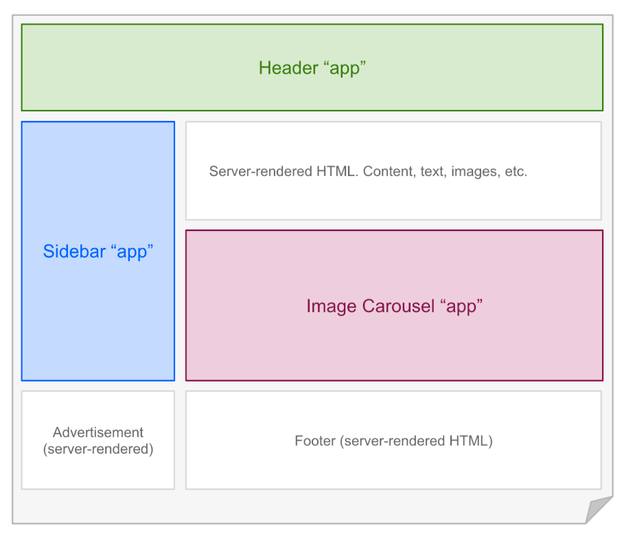
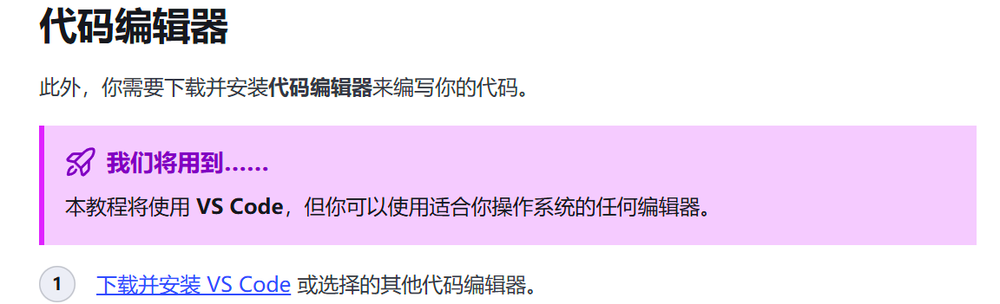

> 作为一个后端开发者，我一直习惯使用IDEA这样大而全的开发工具。对于前端开发，我总是感到力不从心——VS Code的配置让我头疼，前端技术的繁杂让我望而却步。HTML、CSS、JavaScript这些"网页三剑客"我学了又忘，忘了又学，始终无法真正入门。

直到我遇到了Astro。


Astro是一个现代化的静态网站生成器，专为内容驱动的网站而设计。它以群岛架构（Islands Architecture）而闻名，这种架构让网站的加载速度极快，同时保持了开发体验的简洁。

## Astro：一个让前端开发变简单的框架

### 什么是群岛架构？

群岛架构是Astro的核心创新。想象一下，你的网站是一个巨大的岛屿，大部分内容是静态的HTML（陆地），只有在需要交互或动态内容的区域才需要JavaScript（小岛）。



这种架构带来的好处是：
- **极快的加载速度**：大部分页面是静态HTML，JavaScript按需加载
- **优秀的SEO**：内容预渲染为HTML，搜索引擎可以直接索引
- **灵活的UI框架支持**：可以在同一个项目中使用React、Vue、Svelte等框架

### 为什么Astro适合博客搭建？

Astro官方文档明确指出，它最适合构建"像博客、营销网站、电子商务网站这样的以内容驱动的网站"。

对于博客场景，Astro有以下优势：
- **Markdown支持**：原生支持Markdown写作，体验极佳
- **静态生成**：生成纯静态HTML，加载速度飞快
- **部署简单**：可以部署到任何静态托管服务
- **开发友好**：详细的文档，清晰的教程

## 动手实践：从零搭建Astro博客

### 环境准备

首先，你需要安装Node.js（astro对nodejs版本有要求，请参考astro官方说明，我使用的是22.0.0）。然后，使用npm全局安装Astro CLI：

```bash
npm create astro@latest
```

**这里官方还推荐使用vscode:教程会详细说明如何使用**


按照提示操作，选择"Empty"项目模板即可。

### 项目结构解析

安装完成后，你会得到以下目录结构：

```
.
├── astro.config.mjs       # Astro配置文件
├── package.json           # 项目依赖
├── src/                   # 源代码目录
│   ├── components/        # 组件目录
│   ├── layouts/           # 布局目录
│   ├── pages/             # 页面目录
│   └── content/           # 内容目录（Markdown文件）
└── public/                # 静态资源目录
```

这个结构非常清晰：
- **pages目录**：放置所有页面文件，支持Markdown和HTML
- **components目录**：放置可复用的组件
- **layouts目录**：定义页面布局模板
- **content目录**：存放Markdown博客文章

### 创建第一篇文章

在`src/content/blog/`目录下创建你的第一篇Markdown文章：

```markdown
---
title: "我的第一篇Astro博客"
pubDate: "2024-01-20"
description: "这是一篇关于Astro博客搭建的教程。"
author: "你的名字"
---

# 欢迎来到我的博客

这是我的第一篇Astro博客文章。使用Markdown编写非常简单！
```

Markdown的前置元数据（frontmatter）包含了文章的元信息，Astro会自动处理这些数据。

### 配置博客首页

编辑`src/pages/index.astro`，这是你的博客首页：

```astro
---
import Layout from '../layouts/Layout.astro';
import { getCollection } from 'astro:content';

export async function getStaticPaths() {
  const posts = await getCollection('blog');
  return posts.map(post => ({
    params: { slug: post.slug },
    props: { post },
  }));
}

const { post } = Astro.props;
---

<Layout title={post.title}>
  <main>
    <h1>{post.title}</h1>
    <p class="date">{post.pubDate}</p>
    <div class="content">
      <AstroHTML content={post.body} />
    </div>
  </main>
</Layout>

<style>
  h1 { color: #2c3e50; }
  .date { color: #7f8c8d; font-size: 0.9em; }
  .content { margin-top: 2rem; }
</style>
```

这个代码展示了Astro的核心特性：
- **类型安全**：使用TypeScript和Zod进行类型检查
- **组件化**：复用Layout组件
- **静态生成**：使用`getStaticPaths`在构建时生成所有博客文章页面
- **样式隔离**：每个组件的样式都是局部的

### 添加导航和布局

创建`src/layouts/Layout.astro`：

```astro
---
import Header from '../components/Header.astro';
import Footer from '../components/Footer.astro';
---

<html lang="zh-CN">
  <head>
    <meta charset="UTF-8" />
    <meta name="viewport" content="width=device-width, initial-scale=1.0" />
    <title>{title}</title>
    <link rel="stylesheet" href="/styles/global.css" />
  </head>
  <body>
    <Header />
    <slot />
    <Footer />
  </body>
</html>
```

Astro的模板语法非常直观，它基于HTML，添加了一些特殊的指令（如`<slot />`）。

## 高级功能：让你的博客更专业

### 添加代码高亮

Astro内置了代码高亮功能，支持多种语言：

```astro
---
import { useState } from 'react';
---

```javascript
const [count, setCount] = useState(0);
```

```

### 添加导航菜单

创建`src/components/Header.astro`：

```astro
---
import { getCollection } from 'astro:content';

const posts = await getCollection('blog');
---

<header>
  <nav>
    <a href="/">首页</a>
    <a href="/about">关于</a>
    <a href="/archive">归档</a>
  </nav>
</header>
```

Astro允许你在组件中直接获取内容集合，非常方便。

### 生成RSS订阅

在`astro.config.mjs`中添加RSS集成：

```javascript
import { defineConfig } from 'astro/config';
import rss from '@astrojs/rss';

export default defineConfig({
  integrations: [
    rss({
      title: '我的博客',
      description: '最新文章',
      site: 'https://myblog.com',
      items: await getCollection('blog').then(posts =>
        posts.map(post => ({
          title: post.title,
          description: post.description,
          link: `/blog/${post.slug}`,
          pubDate: post.pubDate,
        }))
      ),
    }),
  ],
});
```

## 部署你的博客

Astro支持多种部署方式，这里介绍几种常见的：

### 部署到Vercel

1. 将代码推送到GitHub
2. 在Vercel中导入项目
3. Vercel会自动检测Astro项目并配置构建命令


### 部署到Netlify
我的自己的博客 **击水飞舟** 就使用netlify部署
1. 注册一个netlify账号，国内可访问，免费版完全够用
2. 关联github仓库
3. 根据官方教程设置netlify变量参数
3. 本地代码提交及触发自动部署，也可以手动触发一次部署

### 部署到GitHub Pages

1. 在`astro.config.mjs`中配置：
```javascript
export default defineConfig({
  base: '/your-repo-name/',
  build: {
    output: 'dist',
  },
});
```

2. 将`dist`目录推送到GitHub Pages

## 性能对比：Astro到底有多快？

根据官方数据，Astro相比其他框架有显著的性能优势：

- 比Next.js快40%
- JavaScript减少90%
- 首屏加载极快
- SEO友好，完全静态渲染

这些优势对于博客来说尤为重要。访问者可以快速看到内容，搜索引擎也能很好地索引你的文章。

## 结语：前端开发的新开始

使用Astro搭建博客的过程中，我发现前端开发并没有想象中那么可怕。Astro的设计理念——"内容驱动、服务器优先、默认快速"——让开发变得简单而高效。

作为一个后端开发者，Astro让我能够专注于内容创作，而不必陷入复杂的前端工具配置中。详细的官方教程让我能够快速上手，每个细节都考虑得很周到。

现在，我的博客已经上线，我正在享受写作的乐趣。如果你也像我一样，曾经对前端开发望而却步，不妨试试Astro。它会让你发现，原来搭建一个专业的博客可以这么简单。

---
### 接下来：
接下来我会在详细说下基于astor-paper的开发改造，打造适合自己的博客网站。

---

**相关链接：**
- [Astro官方文档](https://docs.astro.build/zh-cn/)
- [Astro GitHub仓库](https://github.com/withastro/astro)
- [Astro教程](https://docs.astro.build/zh-cn/tutorial/0-introduction/)