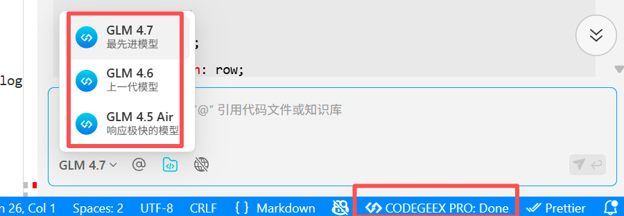
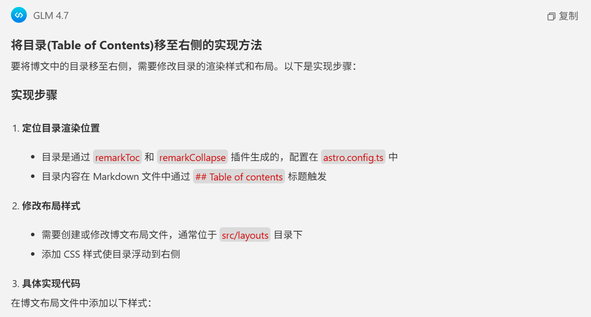
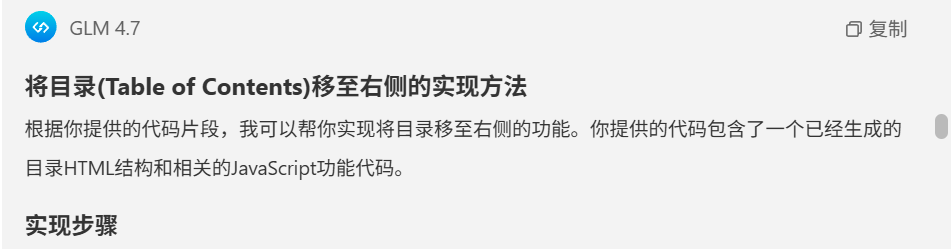

> 上文已经介绍过，为什么选择astro-paper搭建博客，以及如何进行基础搭建和发布，本文将介绍如何使用AI辅助添加博客目录。可以关注之前的文章：[博客搭建[1选型]](./blog-create-2) 

## 为什么要添加目录

在写文章的时候，我们通常会有一个大纲，将文章分为几个部分，这样读者可以快速了解文章的结构，找到自己感兴趣的部分。在博客中，添加目录可以起到类似的作用，让读者可以快速找到自己感兴趣的内容。
原项目已经自带了目录，但是目录是嵌入到正文的上方，在博客向上翻阅后，目录就看不到了。为了方便读者查看目录，并且可以点选目录定位到自己感兴趣的部分， 将目录放到右侧是最好的方式， 既美观有不实用。

## 如何使用AI辅助添加目录
我在vscode的AI历史对话中找到我当初和AI的对话记录，这里分享给大家，其他没什么具体的步骤，主要是配置一个好模型，然后和AI对话。分享给大家主要是让大家一定要有使用AI的意识，很多时候AI可以帮我们节省大量的时间。

### 1. 配置模型
VSCode的AI模型，这里我使用的是CODEGEEX插件， 里面有智谱最新大模型GLM-4.7并且免费使用


### 2. 与AI第一次对话 AI并没有给出正确的答案
`@workspace` 要把博文中的Table of contents放到右侧, 如何实现?


1. 所有页面的目录都放到右侧
2. 目录中的条目不能生成

### 3. 与AI第二次对话 AI并没有给出正确的答案
我参考了 [Kyo's Blog](https://senjianlu.com/posts/updates/blog-migration-2025/) 的目录样式。用F12扣取了他的目录条目生成js代码，扔给AI,让AI结合这个代码给我生成目录。





##### 实现步骤

###### 1. 添加CSS样式

首先，我们需要添加CSS样式来将目录定位到右侧。在你的样式文件中添加以下代码：

```css
/* 目录容器样式 */
.toc-aside {
  position: fixed;
  right: 20px;
  top: 100px;
  width: 250px;
  max-height: calc(100vh - 120px);
  overflow-y: auto;
  background-color: #f9f9f9;
  padding: 15px;
  border-radius: 5px;
  box-shadow: 0 2px 5px rgba(0,0,0,0.1);
  z-index: 100;
}

/* 目录标题样式 */
.toc-title {
  font-weight: bold;
  margin-bottom: 10px;
  padding-bottom: 5px;
  border-bottom: 1px solid #ddd;
}

/* 目录列表样式 */
.toc-list {
  list-style: none;
  padding: 0;
  margin: 0;
}

.toc-list li {
  margin: 5px 0;
}

/* 目录链接样式 */
.toc-link {
  display: block;
  color: #333;
  text-decoration: none;
  padding: 3px 0;
  transition: color 0.2s;
}

.toc-link:hover {
  color: #0066cc;
}

.toc-link.active {
  color: #0066cc;
  font-weight: bold;
}

/* 响应式设计 */
@media (max-width: 1024px) {
  .toc-aside {
    display: none;
  }
}
```

###### 2. 调整布局结构

确保你的HTML结构如下：

```html
<div class="main-container">
  <div class="content-wrapper">
    <article id="article">
      <!-- 文章内容 -->
    </article>
    
    <aside id="toc-container" class="toc-aside">
      <nav class="toc-nav">
        <div class="toc-title">On this page</div>
        <ul id="toc-list" class="toc-list">
          <!-- 目录项将通过JavaScript动态生成 -->
        </ul>
      </nav>
    </aside>
  </div>
</div>
```

###### 3. 修改JavaScript代码

你提供的JavaScript代码已经包含了目录生成和交互功能，但需要做一些调整以确保目录正确显示在右侧：

```javascript
// 修改m函数，确保目录正确定位
function m() {
  const n = document.getElementById("toc-container");
  const o = document.getElementById("main-content");
  if (!n || !o) return;
  const t = o.querySelector("h1");
  if (!t) return;
  const e = t.getBoundingClientRect();
  const i = Math.max(32, e.bottom);
  
  // 确保目录固定在右侧
  n.style.position = 'fixed';
  n.style.right = '20px';
  n.style.top = `${i}px`;
}

// 其余代码保持不变...
```

###### 4. 添加响应式处理

为了在小屏幕上隐藏目录，可以添加以下JavaScript代码：

```javascript
// 添加窗口大小变化监听
window.addEventListener('resize', () => {
  const tocContainer = document.getElementById('toc-container');
  if (window.innerWidth <= 1024) {
    tocContainer.style.display = 'none';
  } else {
    tocContainer.style.display = 'block';
    m(); // 重新计算目录位置
  }
});

// 初始检查
if (window.innerWidth <= 1024) {
  const tocContainer = document.getElementById('toc-container');
  if (tocContainer) {
    tocContainer.style.display = 'none';
  }
}
```

### 4.与Ai的后续对话
大部分代码都已经拿到了，但是对于我一个近似前端小白来说，有些代码不知道怎么改，不知道改那个文件，可以直接问AI
```
@workspace` JavaScript 放到哪个文件?
@workspace` css 放到哪个文件?
@workspace` html 调整哪个文件?
@workspace` 将JavaScript代码再重新整理一遍
@workspace` 目录条目没有生成,请检查代码
```
@workspace 为什么 目录条目 后面都带有"#" 能否去掉?
```js
// 创建目录链接
const tocLink = document.createElement("a");
tocLink.href = `#${heading.id}`;
tocLink.className = "toc-link";

// 移除文本内容开头的"#"符号
tocLink.textContent = heading.textContent.replace(/^#+\s*/, '');
```

**当然还有很多小问题，使用下来AI并不能一次就能解决问题 网上传的AI多强大，一键完成一个软件开发，可能我没有掌握方法。初步感觉诶AI开发，无编程经验小白根本搞不定**