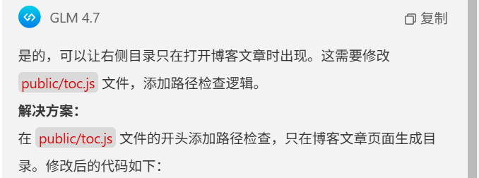
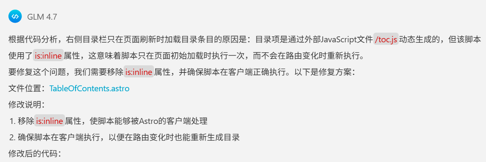
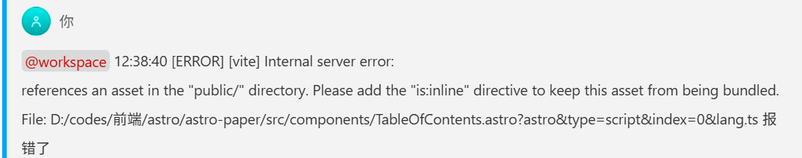
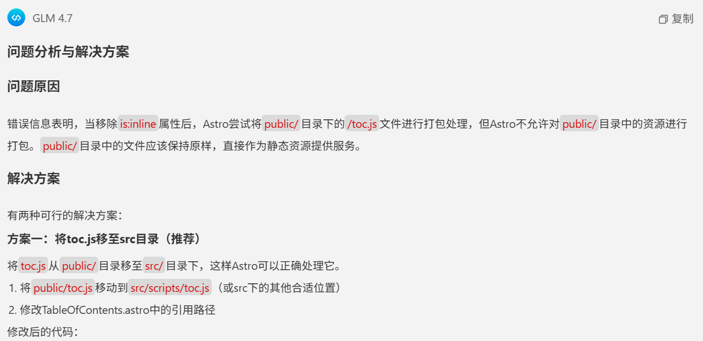

> 上文已经介绍过使用AI辅助添加博客目录的具体操作步骤。本文在补充一些后续AI辅助添加目录的细节，以及AI辅助添加目录的后续优化。

## AI辅助添加目录的后续优化
### @workspace 右侧目录能否在打开博客文章时才出现?



```js
// 目录脚本 - 用于生成和交互文章目录
document.addEventListener("DOMContentLoaded", function () {
  // 检查当前路径是否为博客文章页面
  const currentPath = window.location.pathname;
  if (!currentPath.startsWith('/posts/')) {
    console.log("非博客文章页面，不生成目录");
    return;
  }

  // 获取所有标题元素
  const headings = document.querySelectorAll("h1, h2, h3, h4, h5, h6");

  // 调试：检查是否找到标题元素
  console.log("找到的标题元素数量:", headings.length);

  // 如果没有标题，则不生成目录
  if (headings.length === 0) {
    console.log("未找到标题元素，不生成目录");
    return;
  }

  // ... 其余代码保持不变
});
``` 
### @file src\components\TableOfContents.astro` 重新分析代码,右侧目录栏只有页面刷新的时候才加载目录条目这是什么原因? 修复下?


```astro
---
// 组件逻辑
---

<script src="/toc.js"></script>
<aside class="toc-aside">
  <div class="toc-title">目录</div>
  <ul class="toc-list">
    <!-- 目录项将通过 JavaScript 动态生成 -->
  </ul>
</aside>
```
### 将浏览器控制台报错直接丢给AI



```astro
---
// 组件逻辑
---

<script src="../scripts/toc.js"></script>
<aside class="toc-aside">
  <div class="toc-title">目录</div>
  <ul class="toc-list">
    <!-- 目录项将通过 JavaScript 动态生成 -->
  </ul>
</aside>
代码位置：TableOfContents.astro
```


**经过一番折腾后，AI终于帮我实现了我需要的效果**

### 感悟
1. 如果让我实现，我自己写会有很大很大的困难，几乎实现不了，有了AI我实现了0->1突破
2. 我有一定的代码分析阅读能力，所以我能搞定过程中各种问题，对于纯小白难度极大
3. AI辅助编程，让编程变得简单，让编程变得有趣，我也有成就感