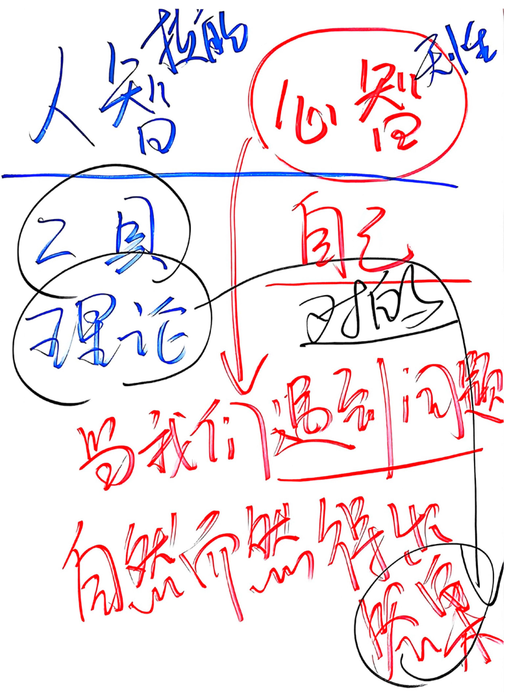
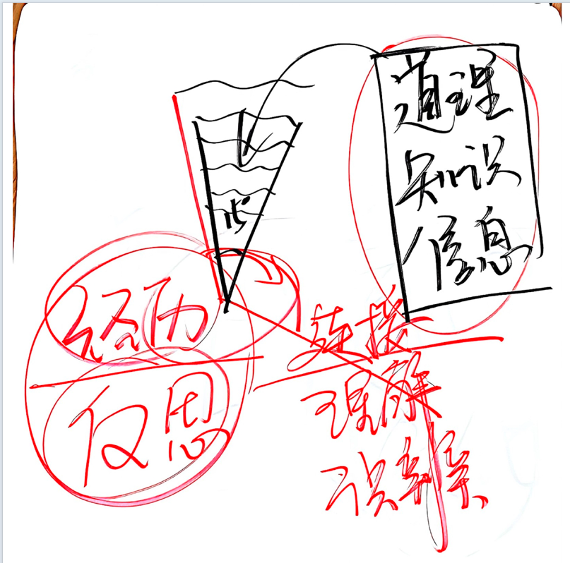
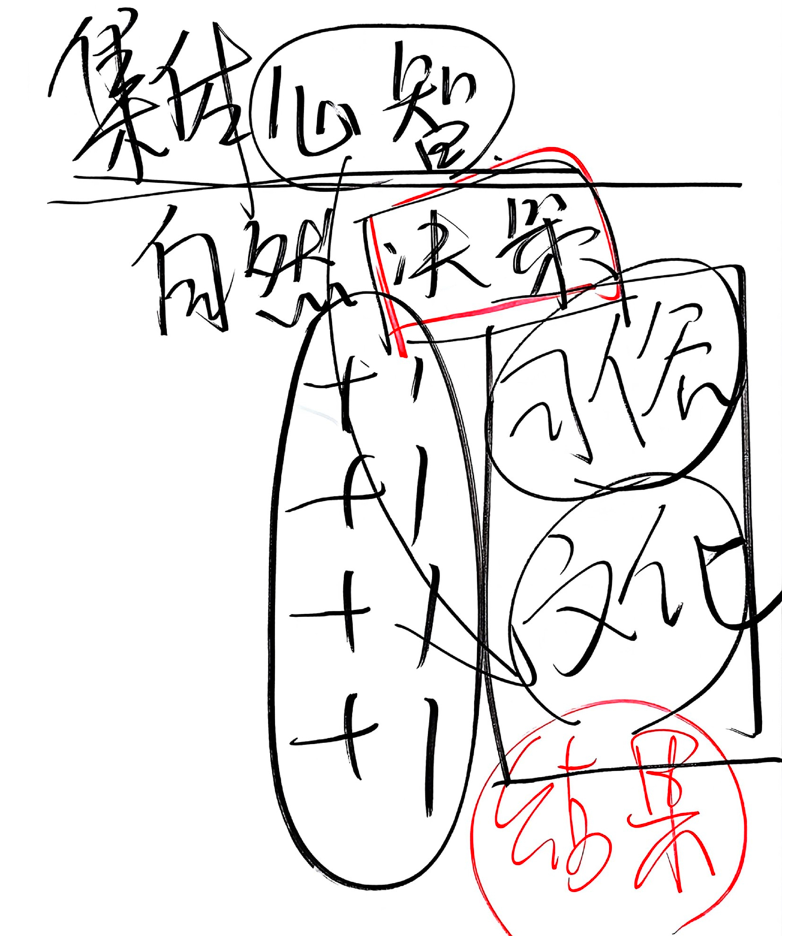
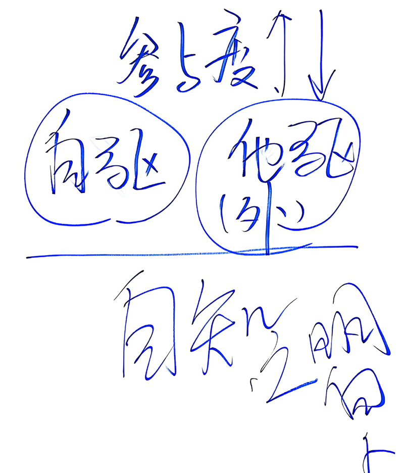
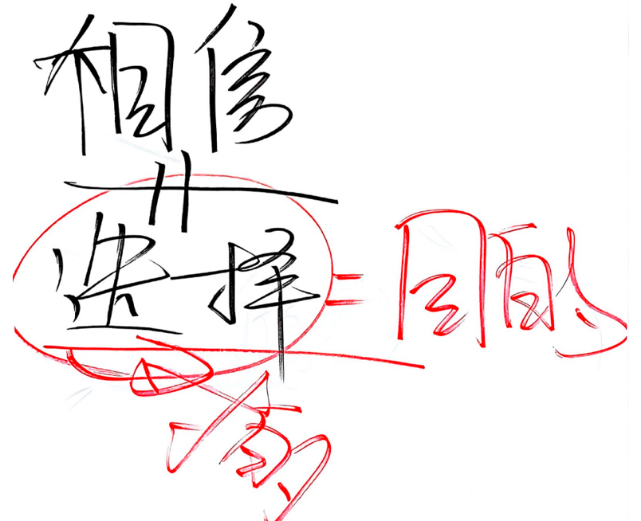
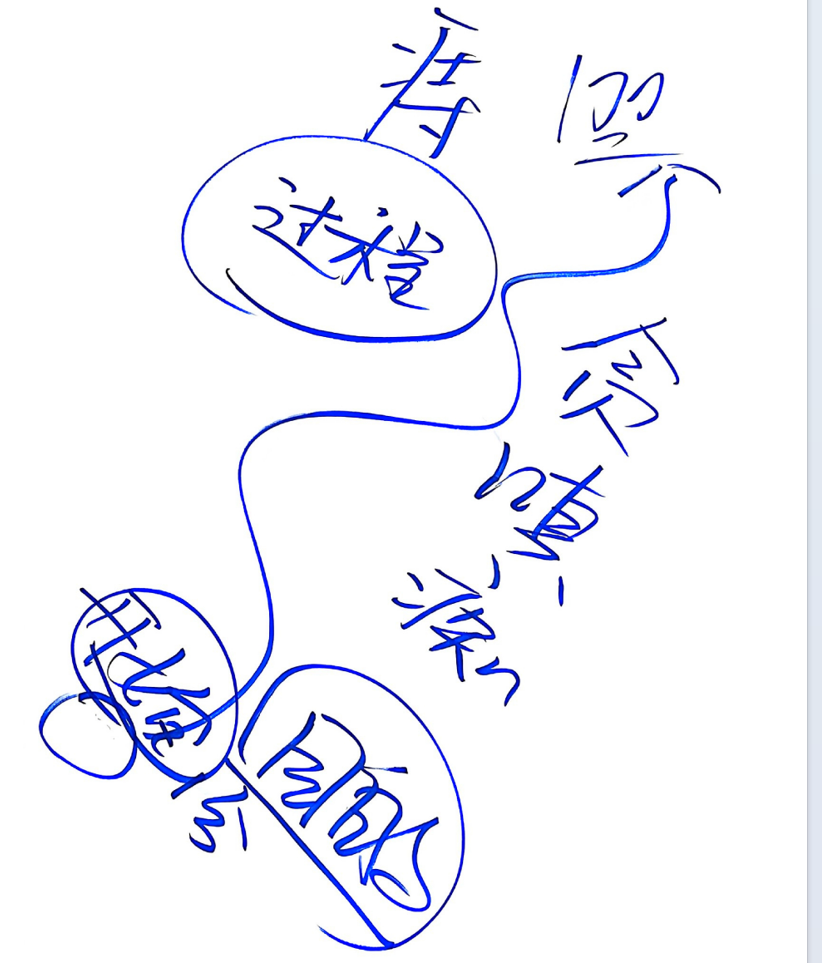

**感谢单位领导安排参加心智领导力培训，收获颇丰，特此记录。**
> 先说出自己的感受，以突出此次培训的对我来说非常非常的重要性。
> 1. 与以往所有培训都不同
> 2. 从抵触到接受到融入到完全感染到励志突破自己
> 3. 中国古人智慧博大精深，中国文化博大精深

## 第一天：人智与心智

人智：人的技能，理论
心智：人的习性，思维模式，是遇到问题时自然而然得出答案
集体的心智: 习俗或文化

将心智比作三角形，人们喜欢往里面放信息，技能，道理，但是如果角度不变，装进去的东西就会越来越多甚至溢出来，放不下太多东西，所以需要改变三角形的角度，才能装进去更多的东西。

如何把角度打开，打开角度越大，能承受的都系就越多。通过经历，反思才能逐步打开自己的心智。

很多公司老板喜欢悬挂：还拿百川，厚德载物等等话语

人贵有自知之明：
自己要做个明白人，但真能做到明白人是不简单的。
做正确的事，还是做有用的事？很多人都执着自己正确，有道理，但往往没有用，因为别人不认同，所以没有用。所以，尤其在家庭关系处理中我们要做有用的事，而不是做正确的事。

我们一般都容易相信几类人（同事， 朋友， 亲戚，兄弟， 发小，邻居， 闺蜜， 同学）
但相信他们后一但做出决定（比如借给他们钱，而花不了的时候）有责怪他们或责怪自己。好像我们从来没想象为什么相信，为什么做出决定（比如借给他钱）？ 面子，利益，虚荣心，关系，幻想，机会等等 。当你做出绝决定的那一个其实已经满足了你某种内心的想法，而最终的结果我们自己必须承受。

所以，相信才能选择，但相信≠选择，一旦选择就要承担这个结果。
如果0-100代表相信到有结果，那么从相信到选择就是0-1，从1-100是获得结构的过程，然而在这个过程中人们往往走偏（贪嗔痴）打到不好的结果。

