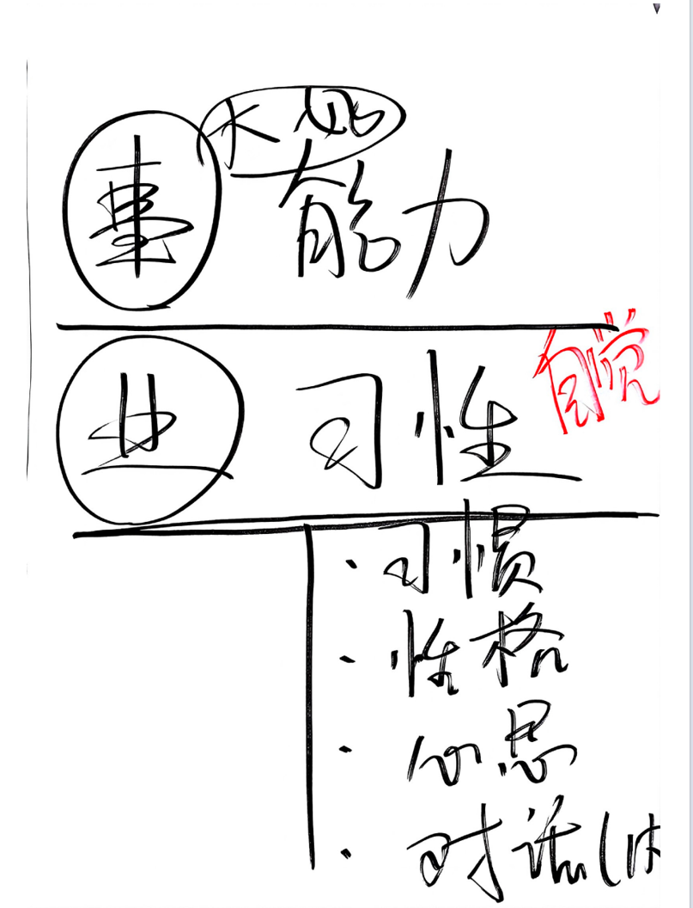
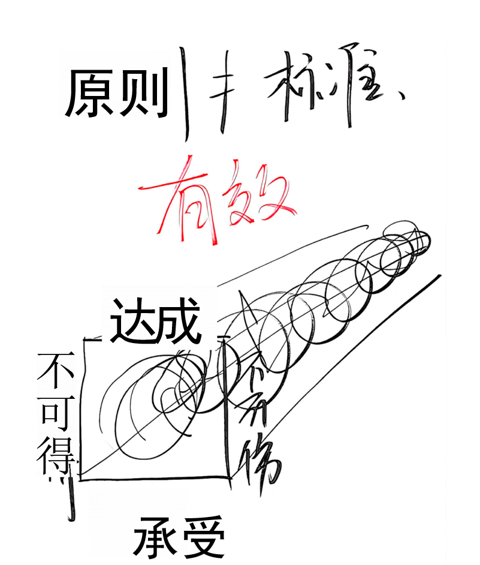
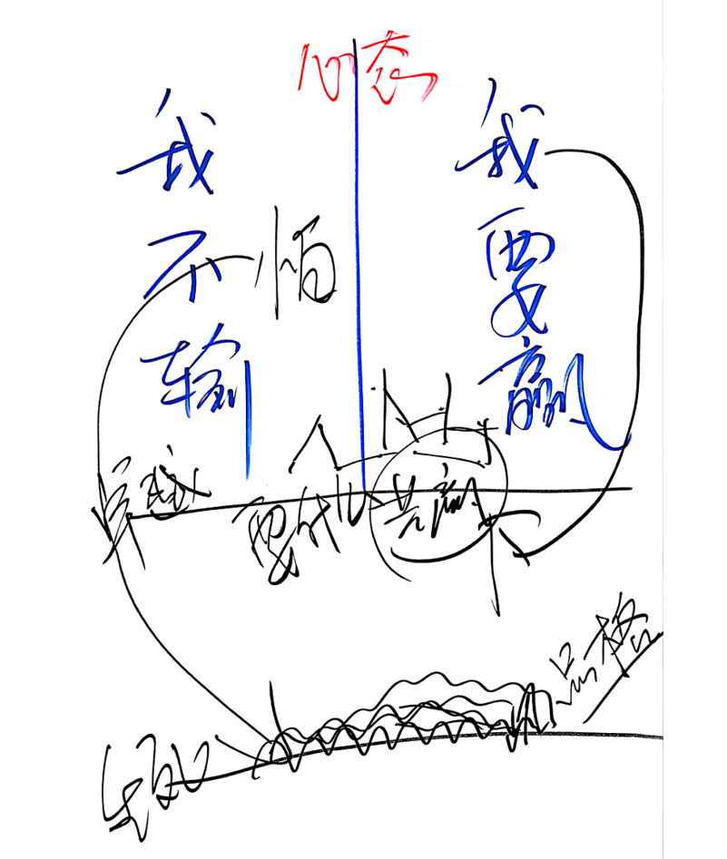
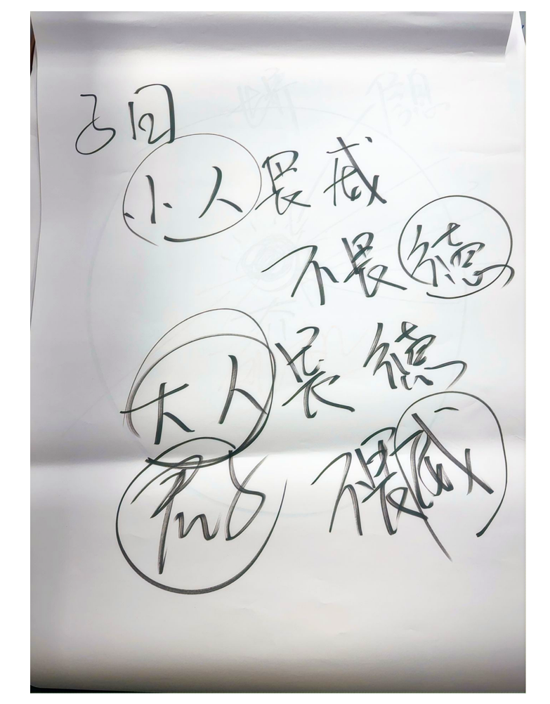

**感谢单位领导安排参加心智领导力培训，收获颇丰，特此记录。**
> 先说出自己的感受，以突出此次培训的对我来说非常非常的重要性。
> 1. 与以往所有培训都不同
> 2. 从抵触到接受到融入到完全感染到励志突破自己
> 3. 中国古人智慧博大精深，中国文化博大精深

## 第二天：事业

事：大事，好事，它是一种能力

业：习性，性格，心思，内心的对话，是需要自觉的

百事随心去，百业随身走：自己做的事是带不走的，而自己种的业始终跟着自己的。抬头三尺有神灵，老天放过谁。

所以做人要有原则，何为原则？
原则就是：不可得，自己能承受的，不可伤， 自己想要达成的。
原则四界：在这个四条边界内自己任意发挥， 打到成功有无数种可能。此所谓真正自由

在活动中反应出同学们2中心态：我不输，我要赢。
这两种心态的人们在生活中，事业中，家庭中，社会中的表现和能获得的成就是截然不同的。
也反应出人们的处事之道：

靠近下方生死线的人们一般都是普通人，他们一旦碰触生死线会立即反弹，然后到舒适区毫无进步。他们在舒适区一般容易发生相互踩踏，产生**螃蟹效应** ，螃蟹效应在职场中非常可怕和可恶，因为这种效应会让人丧失斗志，产生消极情绪，甚至产生消极情绪，从而影响工作，影响事业，影响家庭，影响社会，影响国家，影响民族，影响人类。
而处在上方线以上的大多是卓越人群，他们将就共赢，双赢，和而不同的理念。他们清楚要什么。

在制定原则是是否参考其他人的建议？记住一句话：小人畏威不畏德，大人威德不畏威。看对方是小人还是君子。

