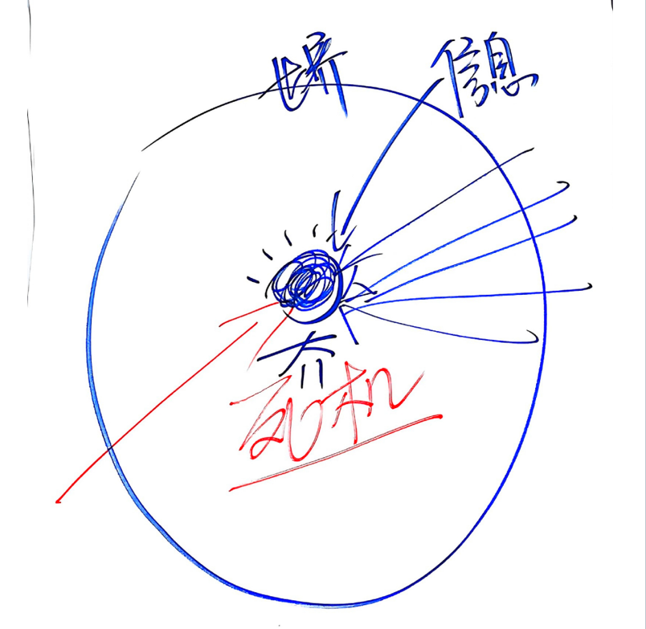
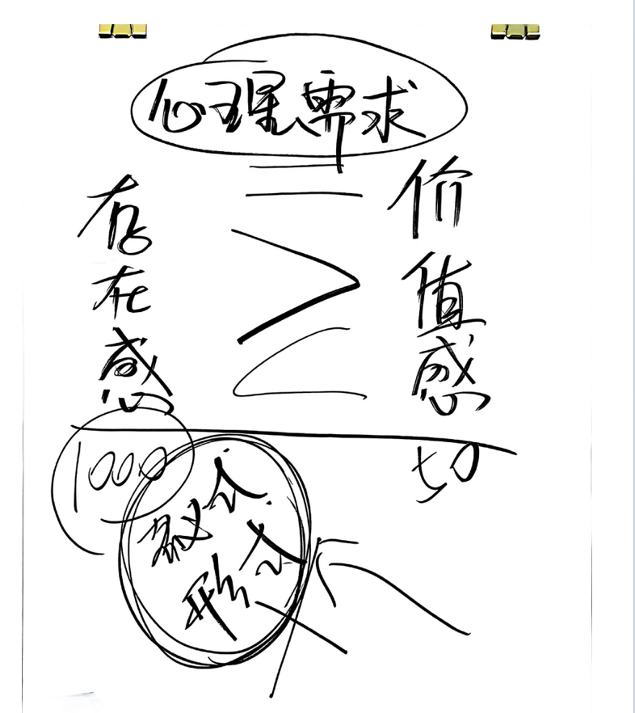
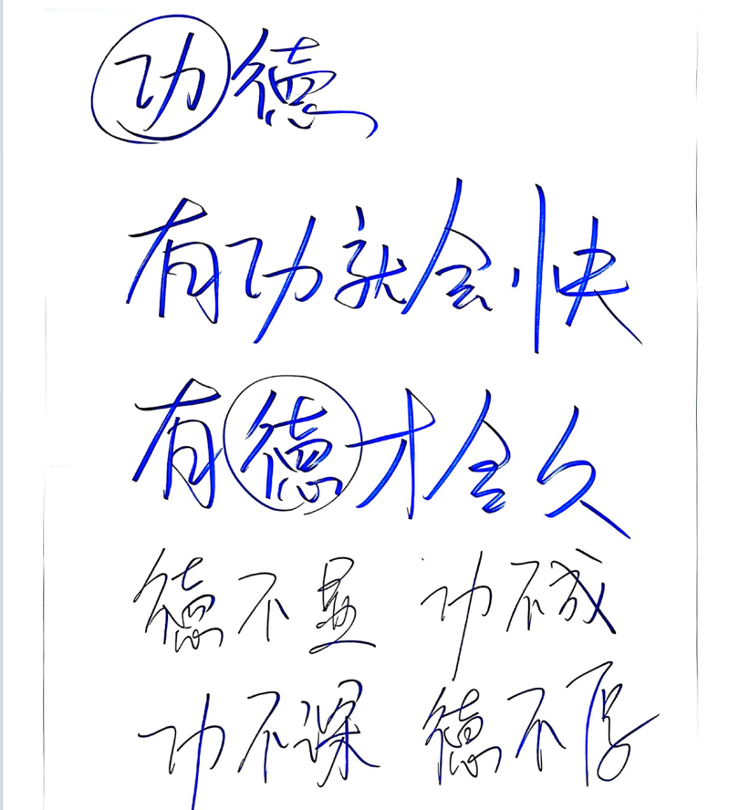
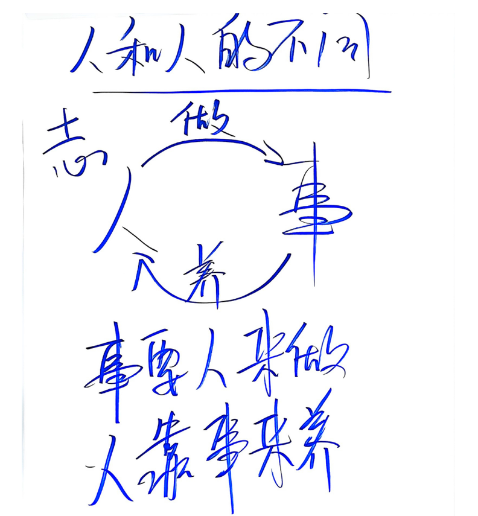
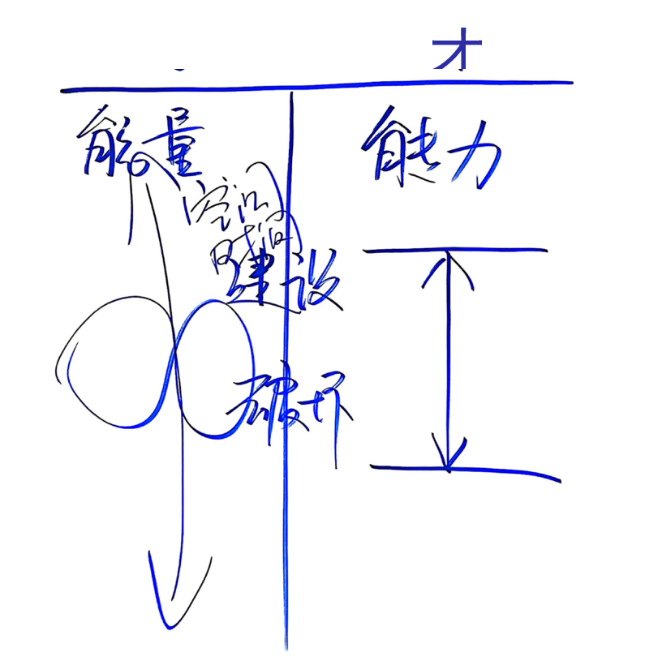
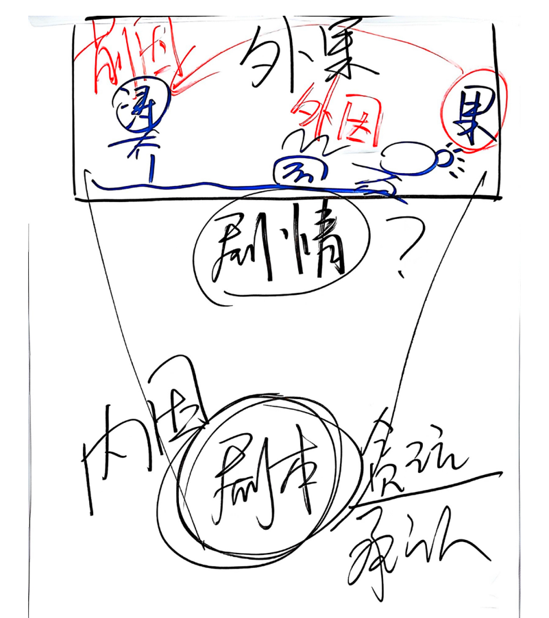

**感谢单位领导安排参加心智领导力培训，收获颇丰，特此记录。**
> 先说出自己的感受，以突出此次培训的对我来说非常非常的重要性。
> 1. 与以往所有培训都不同
> 2. 从抵触到接受到融入到完全感染到励志突破自己
> 3. 中国古人智慧博大精深，中国文化博大精深

## 第三天：效能三要素，注意力，能量，系统

注意力：
人们关注信息越来越多，就容易死机。所以注意力要集中，且关注到自己真正要想的东西上。
注意力是效能的开始。

人们的心理需求分为：存在感，价值感，之间可以用 < = > 来做比较
存在感>价值感：大多流于形式，没有真正的价值。
价值感>存在感：就容易产生内耗。
存在感=价值感：有真正的价值，且存在感充足，才会蒸蒸日上。

记住：德不显，功不成，功不深，德不厚。

能量与能力：
能力是有限的，但能量是无限的。

有功才会快，有的才会久。

因果：
事要人来做，人靠事来养。抓住核心变量，察觉到自己的内因（剧本）。

系统：人们的习俗，习惯，思维模式
升级系统：转到三棱镜，螺旋上升，升级系统。
要多做事，事上练，和高手过招，有改变自己的勇气。

